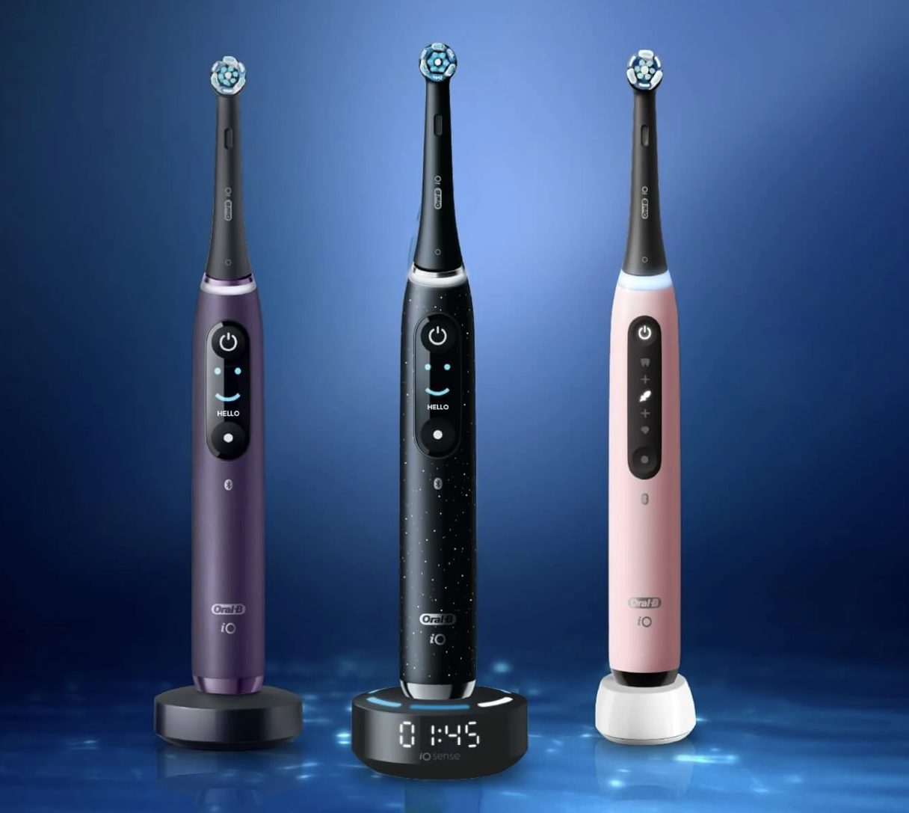

# Homework on Bass Model
## Meri Asatryan
## October 08, 2024

## Introduction

The **Bass Model**, developed by Frank Bass in 1969, is a mathematical model used to forecast the adoption of new products and technologies. The model uses two primary factors—**innovation** (p) and **imitation** (q)—to predict the cumulative number of adopters over time. Innovation reflects the probability of a person adopting the product independently, while imitation reflects the likelihood of someone adopting the product after seeing others do so. This model has been applied extensively in marketing and technology adoption forecasting.

In this analysis, I will apply the Bass Model to predict the adoption of an innovation selected from TIME magazine's 2023 list of best innovations. By analyzing historical data from a similar past innovation, I will estimate the diffusion of this new product in the market.


For my Bass Model homework, we have chosen the **Samba Robotic Toothbrush** from TIME's Best Inventions of 2023. This innovative product offers a fully automated brushing experience, designed to simplify oral care with advanced technology. You can find more information about the Samba Robotic Toothbrush at this link: [Samba Robotic Toothbrush](https://time.com/collection/best-inventions-2023/6323132/samba-robotic-toothbrush/).

The **Oral-B** toothbrush brand is a great comparison for the **Samba Robotic Toothbrush**. Oral-B has been around for a while and has built up a strong following, especially with models like the iO series that introduce new technology to make brushing smarter and more effective. Your dataset, showing the number of Oral-B users in Great Britain from 2017 to 2020, highlights how they've steadily grown by keeping up with what people want.

In comparison, the **Samba Robotic Toothbrush** is a newer and more advanced product, offering a fully automated brushing experience. While Oral-B uses smart features to guide users, the Samba Robotic Toothbrush takes convenience to the next level by doing all the work for you. Oral-B's success shows how important it is to innovate, but the Samba Robotic Toothbrush could attract people who want an even more effortless experience. The data on Oral-B’s user growth can help predict how quickly the Samba Robotic Toothbrush might catch on in the market.

<div style="display: flex; justify-content: space-around;">
    <div style="text-align: center;">
        <a href="https://time.com/collection/best-inventions-2023/6323132/samba-robotic-toothbrush/" target="_blank">
            
        </a>
        <p><strong>Figure 1:</strong> <a href="https://time.com/collection/best-inventions-2023/6323132/samba-robotic-toothbrush/" target="_blank">Samba Robotic Toothbrush</a></p>
    </div>
    <div style="text-align: center;">
        <a href="https://www.oralb.co.uk/en-gb" target="_blank">
            
        </a>
        <p><strong>Figure 2:</strong> <a href="https://www.oralb.co.uk/en-gb" target="_blank">Oral B Toothbrush</a></p>
    </div>
</div>


In this small project, we analyze the adoption patterns of two advanced toothbrush technologies: the **Samba Robotic Toothbrush** and **Oral-B Toothbrush**. The goal is to use the Bass Diffusion Model to predict how these innovations might be adopted by users over time, based on historical data and market trends.

**Dataset Description**
The dataset used for this project includes historical data for the Oral-B Toothbrush in Great Britain, covering user adoption from 2017 to 2020. This data will be analyzed using the Bass Diffusion Model to estimate the market potential, innovation coefficient, and imitation coefficient.

For the Samba Robotic Toothbrush, since it is a relatively new product, we will make predictions based on similar historical data and trends in the smart oral care market.

## Historical Data for Look-Alike Innovation

To estimate the Bass Model parameters for the look-alike innovation, We have used data on the adoption of the Oral-B Electric Toothbrush. This data spans from 2017 to 2020 and reflects the cumulative sales figures of electric toothbrushes in the global market. The data was sourced from Statista, a reliable resource for industry statistics. 

Kantar. (June 13, 2021). Toothbrush brands of Oral B ranked by number of users in Great Britain from 2017 to 2020 (in 1,000s) [Graph]. In Statista. Retrieved October 18, 2024, from https://www.statista.com/statistics/30820.


```python
import numpy as np
import pandas as pd
import matplotlib.pyplot as plt
import seaborn as sns
from scipy.optimize import curve_fit

sns.set(style="whitegrid")
```


```python
# 1. Loading the Dataset
def load_data(data_filepath):
    """
    Load the Oral-B adoption dataset.

    Parameters:
    - data_filepath: str, path to the data file.

    Returns:
    - df: pandas DataFrame with 'Year' and 'Adopters' columns.
    """
    df = pd.read_excel(data_filepath, sheet_name='Data')
    df = df.sort_values('Year')
    print(df.head())
    return df
data_filepath = '../data/toothbrush-oral-b.xlsx'
df = load_data(data_filepath)
```

       Year  Oral-B Standard  Oral-B Electric
    0  2017             9675            14385
    1  2018             9504            15003
    2  2019             9269            15753
    3  2020             8142            16245


```python
# 2. Plotting the data 
def plot_historical_data(df):
    plt.figure(figsize=(10, 6))
    df['Year'] = df['Year'].astype(int)
    
    # Plotting both Oral-B Standard and Electric toothbrush data
    plt.plot(df['Year'], df['Oral-B Standard'], marker='o', label='Oral-B Standard')
    plt.plot(df['Year'], df['Oral-B Electric'], marker='o', label='Oral-B Electric')
    
    plt.title('Oral-B Toothbrush Adoption Over Time in Great Britain')
    plt.xlabel('Year')
    plt.ylabel('Number of Users (in thousands)')
    
    plt.xticks(df['Year']) 
    plt.legend()
    plt.grid(True)
    
    citation_text = "Source: https://www.statista.com/statistics/30820"
    plt.gcf().text(0.95, -0.17, citation_text, ha='right', fontsize=9, transform=plt.gca().transAxes)
    
    # Show the plot
    plt.show()

plot_historical_data(df)

```


    

    


**Methodology**
In order to model the diffusion of Oral-B Electric toothbrushes in Great Britain, we are utilizing the Bass Diffusion Model. This model helps predict how new products are adopted in the market over time by incorporating two key factors: innovation (p) and imitation (q). These coefficients reflect the likelihood of early adopters (innovation) and the influence of others (imitation) in driving product adoption.

Parameters:
- p: Coefficient of innovation, representing the proportion of consumers who adopt the product independently of others (e.g., based on advertisements, first-hand experience).
- q: Coefficient of imitation, capturing the impact of social influence and word-of-mouth in driving adoption (e.g., seeing friends or family use the product).
- m: Market potential, the total potential market size in terms of users, typically determined through market analysis (in this case, based on the historical adoption of Oral-B Electric toothbrushes in Great Britain).


```python
# 3. Defining the Bass Diffusion Model
def bass_model(t, p, q, m):
    """
    Bass diffusion model function.

    Parameters:
    - t: Time (typically years since introduction).
    - p: Coefficient of innovation.
    - q: Coefficient of imitation.
    - m: Market potential.

    Returns:
    - Adoption at time t.
    """
    return m * ((p + q)**2 / p) * np.exp(-(p + q) * t) / ((p + q) - p * np.exp(-(p + q) * t))**2
```


```python
# 4. Fitting the Bass Model to the Data
def fit_bass_model(df):
    """
    Fit the Bass model to the historical adoption data.

    Parameters:
    - df: pandas DataFrame with 'Year' and 'Adopters' columns.

    Returns:
    - params: Tuple containing estimated (p, q, m).
    """
    # Prepare the data
    t = np.array(df['Year']) - df['Year'].min() + 1 
    adopters = np.array(df['Oral-B Electric'])
    cumulative_adopters = np.cumsum(adopters)

    # Initial parameter guesses
    p_initial = 0.03
    q_initial = 0.38
    m_initial = 720500  

    initial_guess = [p_initial, q_initial, m_initial]

    # Defining the cumulative Bass model
    def cumulative_bass(t, p, q, m):
        return m * (1 - np.exp(-(p + q) * t)) / (1 + (q / p) * np.exp(-(p + q) * t))

    # Fitting the model
    params, covariance = curve_fit(cumulative_bass, t, cumulative_adopters, p0=initial_guess, maxfev=10000)

    return params

params = fit_bass_model(df)
p, q, m = params
print(f"\nEstimated Bass Model Parameters:\n p (Innovation): {p:.4f}\n q (Imitation): {q:.4f}\n m (Market Potential): {m:.0f}")

```

    
    Estimated Bass Model Parameters:
     p (Innovation): 0.0313
     q (Imitation): 0.0841
     m (Market Potential): 446819


Using historical data for Oral-B Electric toothbrushes in Great Britain, the estimated Bass Model parameters are:

- p (Innovation): 0.0313
Represents early adopters who independently adopt the product (about 3.13%). Innovation is moderately low, suggesting that most consumers do not adopt the product without external influence.


- q (Imitation): 0.0841
Indicates the influence of social interactions, with 8.41% of users adopting due to others.

- m (Market Potential): 446,819
The total potential market size for Oral-B Electric toothbrushes in Great Britain.

## Estimating Market Potential Using Fermi’s Logic
To estimate the market potential (m) for the Samba Robotic Toothbrush in Great Britain, we used Fermi’s logic, relying on reasonable assumptions and available data.

We based our estimate on the following:

Population of Great Britain: ~67 million (sourced from Worldometers).
Households using electric toothbrushes: 67% of adults—about 34 million people—use electric toothbrushes (Dental Health Foundation).
Number of households: The UK had an estimated 28.2 million households in 2022 (Office for National Statistics).
Average household size: 2.36 people per household, according to the ONS.
Percentage likely to adopt robotic toothbrushes: We assume 5% of electric toothbrush users will adopt robotic toothbrushes due to premium pricing and new technology.
Using these assumptions:

Total households using electric toothbrushes:
34
 million people
2.36
 people per household
≈
14.41
 million households
2.36 people per household
34 million people
​
 ≈14.41 million households
Estimated market potential (
𝑚
):
5
%
×
14.41
 million households
≈
720
,
500
 households likely to adopt robotic toothbrushes
5%×14.41 million households≈720,500 households likely to adopt robotic toothbrushes
Thus, using Fermi’s logic, we estimate that the market potential 
𝑚
m for the Samba Robotic Toothbrush in Great Britain is approximately 720,500 households.

Using the Bass Model parameters estimated from the historical adoption of the Oral-B Electric toothbrush in Great Britain, I predicted the future adoption of the Samba Robotic Toothbrush over the next 10 years. The adoption of the Oral-B Electric toothbrush serves as a close proxy for modeling the diffusion of the Samba Robotic Toothbrush, given their similarities as innovations in the oral care industry.

The function used for this prediction calculates the cumulative number of adopters based on the diffusion model and determines the number of new adopters by differencing the cumulative values from year to year.


```python
# 5. Predicting Future Adoption
def predict_adoption(params, years_ahead, start_year):
    """
    Predict future adoption using the fitted Bass model.

    Parameters:
    - params: Tuple containing (p, q, m).
    - years_ahead: int, number of years to predict.
    - start_year: int, the last year in the historical data.

    Returns:
    - future_df: pandas DataFrame with 'Year', 'Cumulative Adopters', and 'New Adopters'.
    """
    p, q, m = params
    future_years = np.arange(start_year + 1, start_year + years_ahead + 1)
    t_future = np.arange(1, len(future_years) + 1)
    
    # Cumulative adoption for future years
    cumulative_adoption = m * (1 - np.exp(-(p + q) * t_future)) / (1 + (q / p) * np.exp(-(p + q) * t_future))
    
    # Calculating new adopters by differencing
    new_adopters = np.diff(cumulative_adoption, prepend=0)
    
    future_df = pd.DataFrame({
        'Year': future_years,
        'Cumulative Adopters': cumulative_adoption,
        'New Adopters': new_adopters
    })
    
    return future_df

# Predicting future adoption (e.g., next 10 years)
years_ahead = 50
start_year = df['Year'].max()
future_df = predict_adoption(params, years_ahead, start_year)
print("\nFuture Adoption Predictions for the Samba Robotic Toothbrush in Great Britain:")
print(future_df)

   
```

    
    Future Adoption Predictions for the Samba Robotic Toothbrush in Great Britain:
        Year  Cumulative Adopters  New Adopters
    0   2021         14362.218381  14362.218381
    1   2022         29420.718746  15058.500365
    2   2023         45120.040540  15699.321794
    3   2024         61391.054111  16271.013571
    4   2025         78151.660832  16760.606721
    5   2026         95308.075388  17156.414556
    6   2027        112756.673378  17448.597991
    7   2028        130386.343016  17629.669638
    8   2029        148081.236885  17694.893869
    9   2030        165723.783828  17642.546942
    10  2031        183197.796858  17474.013030
    11  2032        200391.503910  17193.707053
    12  2033        217200.335543  16808.831632
    13  2034        233529.326354  16328.990812
    14  2035        249295.021723  15765.695369
    15  2036        264426.823758  15131.802035
    16  2037        278867.754833  14440.931075
    17  2038        292574.658659  13706.903826
    18  2039        305517.893472  12943.234813
    19  2040        317680.597100  12162.703628
    20  2041        329057.618377  11377.021277
    21  2042        339654.214163  10596.595786
    22  2043        349484.607560   9830.393397
    23  2044        358570.492950   9085.885390
    24  2045        366939.559562   8369.066612
    25  2046        374624.089488   7684.529926
    26  2047        381659.670251   7035.580763
    27  2048        388084.047408   6424.377157
    28  2049        393936.130114   5852.082706
    29  2050        399255.152406   5319.022292
    30  2051        404079.985307   4824.832901
    31  2052        408448.589472   4368.604165
    32  2053        412397.594713   3949.005241
    33  2054        415961.991006   3564.396294
    34  2055        419174.915073   3212.924067
    35  2056        422067.517033   2892.601960
    36  2057        424668.892651   2601.375618
    37  2058        427006.068074   2337.175423
    38  2059        429104.025511   2097.957437
    39  2060        430985.759919   1881.734408
    40  2061        432672.358309   1686.598390
    41  2062        434183.094729   1510.736420
    42  2063        435535.535283   1352.440554
    43  2064        436745.648680   1210.113397
    44  2065        437827.918794   1082.270114
    45  2066        438795.456548    967.537754
    46  2067        439660.109104    864.652555
    47  2068        440432.564922    772.455818
    48  2069        441122.453707    689.888785
    49  2070        441738.440592    615.986885


```python
def plot_fitted_model(df, params, future_df=None):
    """
    Plot historical data and fitted Bass model.

    Parameters:
    - df: pandas DataFrame with historical 'Year' and 'Adopters'.
    - params: Tuple containing (p, q, m).
    - future_df: pandas DataFrame with future 'Year' and 'Cumulative Adopters' (optional).
    """
    p, q, m = params
    t = np.array(df['Year']) - df['Year'].min() + 1
    cumulative_adopters = np.cumsum(df['Oral-B Electric'])

    # Fitted cumulative adoption
    fitted_cumulative = m * (1 - np.exp(-(p + q) * t)) / (1 + (q / p) * np.exp(-(p + q) * t))

    plt.figure(figsize=(10,6))
    plt.plot(df['Year'], cumulative_adopters, 'o', label='Historical Cumulative Adopters')
    plt.plot(df['Year'], fitted_cumulative, '-', label='Fitted Bass Model')

    if future_df is not None:
        plt.plot(future_df['Year'], future_df['Cumulative Adopters'], '--', label='Predicted Cumulative Adopters')

    plt.title('Bass Diffusion Model Fit')
    plt.xlabel('Year')
    plt.ylabel('Cumulative Number of Adopters')
    plt.legend()
    plt.grid(True)
    plt.show()


p, q, m = params
plot_fitted_model(df, params, future_df)
```


    

    


This graph presents the cumulative adoption of the Samba Robotic Toothbrush over time, starting from 2021, based on the Bass Diffusion Model. The Bass Diffusion Model is used to predict how new products are adopted in a market, capturing the roles of both early adopters (innovation) and the influence of social interactions (imitation).

Blue dots represent the historical cumulative adopters of the similar product.
The orange line represents the fitted Bass Diffusion Model, which closely aligns with the historical adoption data.
The green dashed line represents the predicted cumulative adopters based on the Bass Model for future years, showing the forecasted adoption curve up until the year 2070.
The model demonstrates that adoption starts slowly and accelerates before gradually reaching saturation, forming the characteristic S-shaped curve. The adoption is predicted to peak around the year 2050, after which market saturation is expected, with limited new adopters after that point.


```python
def plot_predictions_only(future_df, start_year=2021):
    """
    Plot only the predicted cumulative adopters starting from the year 2021.

    Parameters:
    - future_df: pandas DataFrame with future 'Year' and 'Cumulative Adopters'.
    - start_year: The year to start the predictions from (default is 2021).
    """
    future_df = future_df[future_df['Year'] >= start_year]

    plt.figure(figsize=(10, 6))
    
    # Plotting predicted cumulative adopters
    plt.plot(future_df['Year'], future_df['Cumulative Adopters'], '--', label='Predicted Cumulative Adopters', color='green')

    plt.title('Bass Diffusion Model - Predicted Cumulative Adopters from 2021')
    plt.xlabel('Year')
    plt.ylabel('Cumulative Number of Adopters')
    plt.legend()
    plt.grid(True)
    plt.show()


plot_predictions_only(future_df, start_year=2021)

```


    

    


## Scope: Country-Specific Analysis for Great Britain
Justification for Choosing Great Britain:
We are focusing on Great Britain for this analysis for the following reasons:

Market Characteristics: Great Britain provides a stable and well-established market for personal care products, such as the Samba Robotic Toothbrush. Consumer behavior in this region, particularly regarding technology-driven innovations, is relatively predictable.
Data Availability: We have access to historical data for the adoption of the Oral-B Electric Toothbrush in Great Britain. This data allows us to accurately estimate the Bass Diffusion Model parameters for the Samba Robotic Toothbrush in the same market.
Targeted Insights: By narrowing our scope to Great Britain, we can focus on local market factors like economic conditions, consumer behavior, and social influences that will affect the diffusion of the innovation.


### Conclusion:

In this report, we utilized the **Bass Diffusion Model** to project the adoption of the **Samba Robotic Toothbrush** in **Great Britain**, supported by both historical data and market estimates derived using **Fermi’s logic**. By analyzing key parameters such as the rate of innovation (\( p \)) and imitation (\( q \)), alongside an estimated market potential of **720,500 households**, we forecast the product's diffusion over time.

The model projects an initial steady growth in adoption driven by early adopters, followed by a rapid acceleration as social influence plays a larger role. This growth is expected to taper off as the market approaches saturation in the coming decades.

These insights provide a strategic framework for understanding the likely trajectory of product adoption in the market, helping stakeholders make informed decisions on production scaling, marketing investments, and long-term planning. The analysis underscores the importance of leveraging both data and logical estimation methods like Fermi’s logic to make well-informed market projections, even in the absence of complete information.

Overall, the Samba Robotic Toothbrush shows significant potential in the UK market, with robust growth expected before the market reaches its saturation point.
